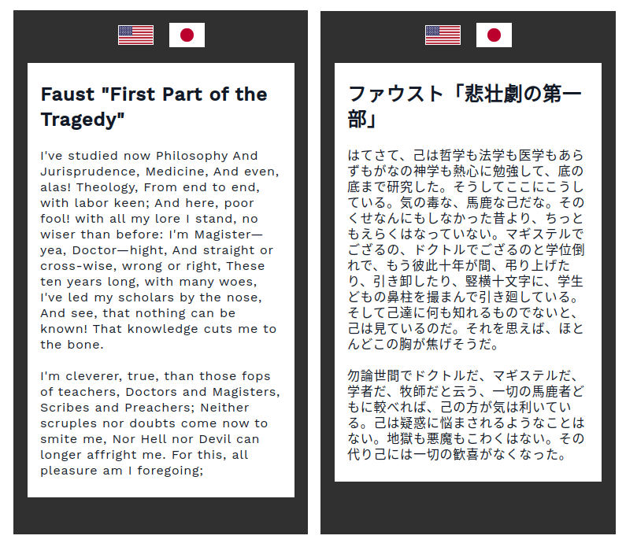

# simple-i18n-solution

A simplified version of what I have for my website for i18n localization.

## 1. About



I spent enormous effort trying to figure out the most convenient ways to provide i18n solutions, and this is what I came up with.

### Basic Ideas
Basically, this is how it goes:

1. Server app uses some kind of a template engine.
1. Prepare 2 templates for English and Japanese.
1. Include them in one page.
1. Use JS to switch between the DOM elements.

__I'm not saying you should go back to the 90s.__
From designers perspective, they don't want to deal with
a collection of random texts scattered around in JSON format.
__Instead, they want HTML, or to work on a group of DOM elements as a chunk.__

So, the idea behind is this:  
__Pass the data as DOM elements from the server-side.__

In reality, I am using SolidJS to provide the feature as a WebComponent widget.  
Whenever I want translations for a page, I embed the widget, and the widget takes care everything.  
([Check out my website](https://astralscience.com/about) for one of the pages)

### Advantages
- __Always have 2 templates__ for 2 languages which is intuitive to manage.
- You can avoid __hundreds of locale files scattered around the project__ which is hard to grasp.  
(which happens when managing i18n on JS side)
- __Designers get to work on the page as HTML__, not meaningless JSON key-values.

## 2. Instructions

```shell
# Install NPM packages for server apps
cd server
npm install

# Launch the Express server
cd ../
make watch.server
```

## 3. License

Dual-licensed under either of the followings.  
Choose at your option.

- The UNLICENSE ([LICENSE.UNLICENSE](LICENSE.UNLICENSE))
- MIT license ([LICENSE.MIT](LICENSE.MIT))

